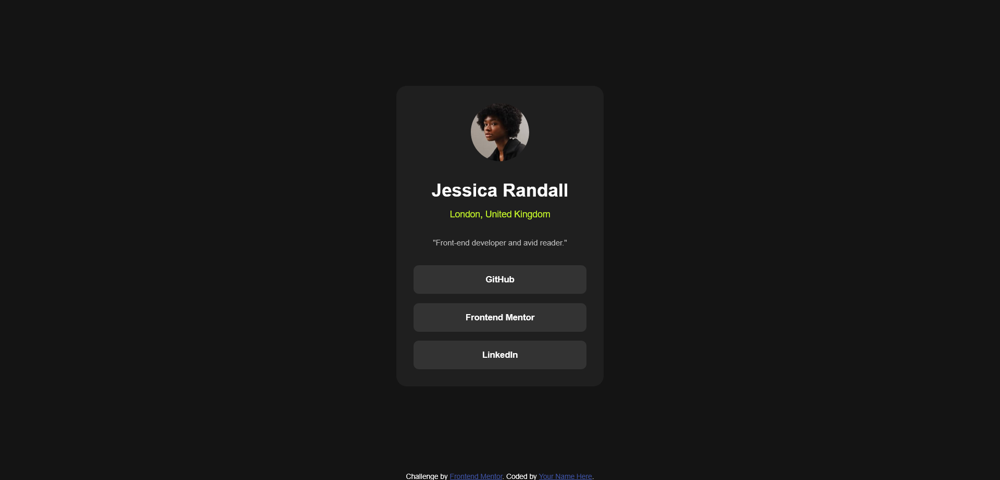

# Frontend Mentor - Social links profile solution

This is a solution to the [Social links profile challenge on Frontend Mentor](https://www.frontendmentor.io/challenges/social-links-profile-UG32l9m6dQ). Frontend Mentor challenges help you improve your coding skills by building realistic projects. 

## Table of contents

- [Overview](#overview)
  - [The challenge](#the-challenge)
  - [Screenshot](#screenshot)
  - [Links](#links)
- [My process](#my-process)
  - [Built with](#built-with)
  - [What I learned](#what-i-learned)
- [Author](#author)

## Overview

### The challenge

Users should be able to:

- See hover and focus states for all interactive elements on the page

### Screenshot



### Links

- Solution URL: [Add solution URL here](https://github.com/OAguilaLira/social-links-profile-main)
- Live Site URL: [Add live site URL here](https://oaguilalira.github.io/social-links-profile-main/)

## My process

### Built with

- Semantic HTML5 markup
- CSS custom properties
- CSS Grid
- Mobile-first workflow

### What I learned

While working on this project, I learned several important concepts and techniques that helped me improve my front-end development skills.

#### Using Local Fonts

I learned how to include and use a locally hosted font in my project. This allows for better performance and control over the font files. Here's an example of how I included the Inter variable font:

```css
@font-face {
    font-family: 'InterVariable';
    src: url('Inter-VariableFont_slnt,wght.ttf') format('truetype');
    font-weight: 100 900; /* Range of weights covered by the variable font */
    font-style: normal;
}
```

#### CSS Custom Properties (Variables)

Another key concept I explored was CSS variables. By using :root, I was able to define global variables that could be reused throughout the stylesheet. This makes it easier to maintain consistency and adjust styles without searching for each individual property. Here's how I set up my custom properties for colors:

```css
:root {
    --background-color-primary: hsl(0, 0%, 8%);
    --background-color-secondary: hsl(0, 0%, 12%);
    --background-color-tertiary: hsl(0, 0%, 20%);
    --text-color-primary: hsl(0, 0%, 100%);
    --text-color-secondary: hsl(75, 94%, 57%);
    --text-color-tertiary: hsl(0, 0%, 75%);
}
```

This approach allowed me to easily adjust the theme of the page just by tweaking a few values, without having to change each color property manually.

## Author

- Website - [Add your name here](https://www.your-site.com)
- Frontend Mentor - [@yourusername](https://www.frontendmentor.io/profile/yourusername)
